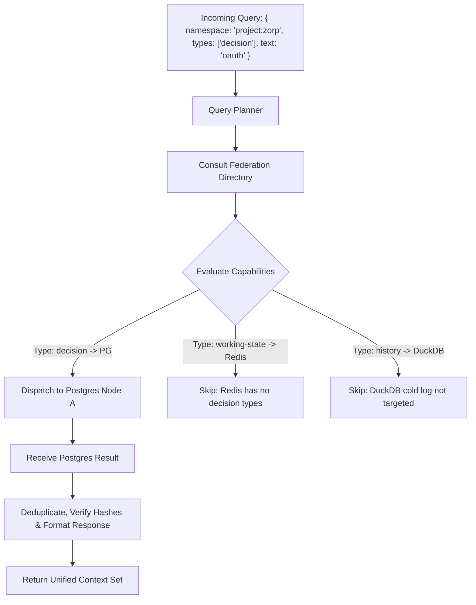

# Open Context 2.0: Distributed Context Data Plane & Scalability Architecture Specification

> **Document Version:** 2.0.0-PROPOSAL  
> **Status:** Approved Architecture Specification  
> **Target Release:** Open Context 2.0 Distributed Engine  
> **Repository:** `aviskaar/open-context`  
> **Classification:** Core Technical & Distributed Systems Specification  

---

## Table of Contents

1. [Executive Summary & Core Scaling Philosophy](#1-executive-summary--core-scaling-philosophy)
2. [The Three-Plane Architecture](#2-the-three-plane-architecture)
3. [The Open Context Node: Fundamental Deployment Unit](#3-the-open-context-node-fundamental-deployment-unit)
4. [Namespace-Based Partitioning & Ordering Boundary](#4-namespace-based-partitioning--ordering-boundary)
5. [Storage & Event Plane Decoupling (CDC & Outbox)](#5-storage--event-plane-decoupling-cdc--outbox)
6. [The Normalized `ContextEvent` Model](#6-the-normalized-contextevent-model)
7. [Durable Event Log Architecture (`EventBackend` SPI)](#7-durable-event-log-architecture-eventbackend-spi)
8. [Stateless Subscription Fleet & Distributed Event Matching](#8-stateless-subscription-fleet--distributed-event-matching)
9. [Consistency, Identity & Delivery Guarantees](#9-consistency-identity--delivery-guarantees)
10. [Federation Directory & Capability-Aware Query Planner](#10-federation-directory--capability-aware-query-planner)
11. [Data-Plane Peer-to-Peer Transfer & Backpressure (CSTP/CTP)](#11-data-plane-peer-to-peer-transfer--backpressure-cstpctp)
12. [Horizontal Scalability Topology](#12-horizontal-scalability-topology)
13. [Implementation Phases & Phased Rollout](#13-implementation-phases--phased-rollout)

---

## 1. Executive Summary & Core Scaling Philosophy

### 1.1 The Core Product Principle
```
┌─────────────────────────────────────────────────────────────────────────────┐
│                                                                             │
│                  "Don't build a giant distributed database.                 │
│                                                                             │
│   Build a distributed layer that makes existing databases behave like one    │
│                            context system."                                 │
│                                                                             │
└─────────────────────────────────────────────────────────────────────────────┘
```

Open Context scales **not** by storing every customer's context centrally, but by deploying lightweight, stateless **Open Context Nodes** close to the databases where customer data already lives.

PostgreSQL, Redis, MongoDB, DynamoDB, SurrealDB, and SQLite continue doing what they do best: physical storage, durability, and native indexing. Open Context owns:
- **Identity & Canonical Semantics**
- **Partitioning & Query Routing**
- **Reactive Event Streaming & Durable Cursors**
- **P2P State Transfer & Delta Synchronization**
- **Federation & Governance**

---

## 2. The Three-Plane Architecture

Open Context explicitly separates responsibilities into three independent, decoupled operational planes:

```text
                               CONTROL PLANE
                  ┌─────────────────────────────────────┐
                  │ Namespaces / Routing / Auth / Policy│
                  │ Provider Registry & Capabilities    │
                  │ Subscription & Federation Directory │
                  └──────────────────┬──────────────────┘
                                     │ (Orchestration / Metadata)
                                     ▼
                                DATA PLANE
        ┌─────────────────────────────────────────────────────────┐
        │  Open Context Node A               Open Context Node B  │
        │         │                                   │           │
        │    PostgreSQL                             Redis         │
        │         │                                   │           │
        │         └────────── Direct CSTP ────────────┘           │
        └────────────────────────────┬────────────────────────────┘
                                     │ (Mutations / Streams)
                                     ▼
                               EVENT PLANE
        ┌─────────────────────────────────────────────────────────┐
        │  Normalized ContextEvent Bus (NATS JetStream / Kafka)   │
        │  Durable Cursors / Checkpoints / Subscriptions / CDC    │
        └─────────────────────────────────────────────────────────┘
```

### 2.1 The Three Planes Defined
1. **Control Plane:**
   - *Question Answered:* "Who owns what context? Where does it physically live? What policies, routes, and capabilities apply?"
   - *State Stored:* Route tables, namespace partition maps, node health, subscription registrations, security policies.
2. **Data Plane:**
   - *Question Answered:* "Read, write, query, and transfer context objects."
   - *Responsibility:* Physical persistence via `ContextStore` drivers, direct Node-to-Node delta synchronization, query planning.
3. **Event Plane:**
   - *Question Answered:* "What changed? Who is subscribed? Where should the delta stream go? Where should an agent resume?"
   - *Responsibility:* Ordered change capture (CDC), durable event log buffering, sequence acknowledgement, and fan-out dispatch.

---

## 3. The Open Context Node: Fundamental Deployment Unit

The basic building block of Open Context is the **Open Context Node (OC-Node)**. An OC-Node sits co-located with or adjacent to the target physical database.

```text
                            OPEN CONTEXT CLOUD
                          (Central Control Plane)
                                     │
                 ┌───────────────────┼───────────────────┐
                 │ (Control Traffic) │ (Control Traffic) │ (Local Dev)
                 ▼                   ▼                   ▼
           Customer A VPC      Customer B Cloud        Local Workstation
        ┌──────────────────┐ ┌──────────────────┐ ┌──────────────────┐
        │  OC-Node 1       │ │  OC-Node 2       │ │  OC-Node (Local) │
        │        │         │ │        │         │ │        │         │
        │  PostgreSQL (RDS)│ │  MongoDB Atlas   │ │  SQLite / Memory │
        └──────────────────┘ └──────────────────┘ └──────────────────┘
```

### 3.1 Node Responsibilities
Each OC-Node is a lightweight process implementing:
- **`ContextStore` SPI:** Native database CRUD and query translation.
- **`ChangeCaptureEngine`:** Database change feed listener (CDC or Transactional Outbox).
- **`CstpEngine`:** Node-to-Node direct state transfer and delta sync server/client.
- **`SubscriptionAgent`:** Local durable cursor progression and event delivery.

### 3.2 Deployment Advantages
- **Data Sovereignty & Zero Central Ingestion:** Context data never leaves the customer's VPC unless explicitly transferred or federated.
- **Horizontal Scalability:** Scaling capacity requires adding lightweight node instances rather than expanding a central multi-tenant storage cluster.
- **Local-First Parity:** The exact same binary runs on an engineer's laptop (`opencontext start --db sqlite`) or across enterprise Kubernetes clusters.

---

## 4. Namespace-Based Partitioning & Ordering Boundary

### 4.1 The Partitioning Key
Every canonical context object belongs to an explicit **`namespace`**:
```text
user:123
project:zorp
org:aviskaar
agent:researcher-92
session:sess_48102
```

The namespace serves as the primary distributed partition key:

```text
hash(namespace) ──► Partition / Shard ID ──► Target OC-Node Fleet ──► Target Database Cluster
```

```text
Example:
  project:zorp  ──► Shard 27 ──► OC-Node Pod 4 ──► Postgres Cluster Alpha
  project:core  ──► Shard 12 ──► OC-Node Pod 2 ──► Mongo Shard Beta
```

### 4.2 The Ordering Invariant
Distributed systems fail when attempting to enforce global total ordering across independent tenants. Open Context enforces a clean, scalable boundary:

> **Invariant:** Global total ordering across namespaces is NOT required.  
> **Guarantee:** Strict, monotonic, causal ordering is guaranteed **within each individual context namespace**.

This allows independent namespaces to scale concurrently across distinct nodes, threads, and event streams without cross-partition lock contention or coordination overhead.

---

## 5. Storage & Event Plane Decoupling (CDC & Outbox)

### 5.1 The Anti-Pattern: Dual-Write Bug
A classic distributed systems trap is writing to the database and event bus separately:
```text
Agent Write ──► [1] Write Database (Success)
            ──► [2] Write Event Bus (Network Timeout / Crash -> INCONSISTENCY!)
```

### 5.2 Decoupled Write Path
Open Context enforces single-source-of-truth mutations via **Change Data Capture (CDC)** or **Transactional Outbox**:

```text
Agent Mutation Request
         │
         ▼
  Open Context Node
         │
         ▼
  Target Storage Provider (PostgreSQL / MongoDB / Redis)
         │ [Single Transactional Write]
         ▼
  Physical Storage (WAL / Oplog / Outbox Table)
         │
         ▼
  Change Capture Engine (Native CDC or Outbox Reader)
         │
         ▼
  Normalized ContextEvent
         │
         ▼
  Durable Event Log (NATS JetStream / Kafka / SQLite Log)
         │
         ├───────────────────────┬───────────────────────┐
         ▼                       ▼                       ▼
   Subscription Worker A   Subscription Worker B   Federation Peer Node
```

### 5.3 Provider Change Feed Capabilities

```ts
export interface ChangeFeedCapabilities {
  nativeCDC: boolean;       // e.g. Postgres WAL, Mongo Oplog, DynamoDB Streams
  resumable: boolean;       // Supports resuming from LSN / token
  ordered: boolean;         // Guarantees monotonic sequence within partition
  transactional: boolean;   // Outbox consistency
}
```

- **PostgreSQL:** Logical Replication / `pgoutput` publication or WAL listener.
- **MongoDB:** Change Streams over Replica Set Oplog.
- **Redis:** Redis Streams (`XADD`) or Key Space Notifications.
- **DynamoDB:** DynamoDB Streams $\rightarrow$ Kinesis.
- **SQLite / Embedded:** Transactional local `context_events` table with monotonic sequence trigger.

---

## 6. The Normalized `ContextEvent` Model

To prevent the event and transfer layers from needing custom adapters for 15+ database dialects, Open Context normalizes every mutation into a standard `ContextEvent`.

### 6.1 Schema Specification

```ts
export type EventOperation = 'INSERT' | 'UPDATE' | 'DELETE' | 'LIFECYCLE_CHANGE' | 'CHECKPOINT';

export interface ContextEvent<T = Record<string, unknown>> {
  /** Unique monotonic event identifier (ULID) */
  eventId: string;

  /** Partition key and isolation boundary */
  namespace: string;

  /** Target context entity ID */
  objectId: string;

  /** Mutation type */
  operation: EventOperation;

  /** Monotonic revision number within the namespace */
  version: number;

  /** Originating node or cluster identifier */
  origin: string;

  /** Hybrid Logical Clock timestamp (ISO-8601 UTC + logical counter) */
  timestamp: string;

  /** Opaque cursor token for stream resumption */
  checkpointCursor: string;

  /** SHA-256 hash of the payload for tamper verification */
  contentHash: string;

  /** Event mutation payload */
  payload: {
    previousRevision?: number;
    before?: Partial<T>;
    after?: T;
    patch?: Record<string, unknown>;
  };
}
```

With this model, downstream consumers (CSTP, Subscriptions, Federation, Audit Logs) operate entirely on `ContextEvent`, `ContextSnapshot`, `ContextDelta`, and `ContextCheckpoint`.

---

## 7. Durable Event Log Architecture (`EventBackend` SPI)

To support reactive context subscriptions with crash resilience, Open Context defines a pluggable `EventBackend` SPI.

```text
                              EventBackend SPI
                                     │
       ┌──────────────────┬──────────┴──────────┬──────────────────┐
       ▼                  ▼                     ▼                  ▼
 InMemoryBackend     SqliteEventLog        NatsJetStream      KafkaEventLog
 (Testing/CLI)       (Single-Node Edge)   (Distributed Std)   (Hyperscale)
```

### 7.1 The `EventBackend` Interface

```ts
export interface EventPublishAck {
  sequenceNumber: bigint;
  cursor: string;
  publishedAt: string;
}

export interface ConsumerOptions {
  consumerGroup: string;
  namespace: string;
  startCursor?: string;
  deliveryPolicy: 'all' | 'new' | 'from_cursor';
  ackWaitMs: number;
}

export interface EventBackend {
  readonly id: string;

  connect(): Promise<void>;
  disconnect(): Promise<void>;

  /** Publish normalized event to the namespace stream */
  publish(event: ContextEvent): Promise<EventPublishAck>;

  /** Create or bind to a durable consumer stream */
  subscribe(opts: ConsumerOptions): AsyncIterable<{
    event: ContextEvent;
    ack(): Promise<void>;
    nack(): Promise<void>;
  }>;
}
```

### 7.2 Default Distributed Implementation: NATS JetStream
For distributed deployments, **NATS JetStream** is the standard event backbone:
- **Stream per Namespace / Shard:** `OPENCONTEXT.EVENTS.{namespace}.>`
- **Durable Consumers:** Tracks subscriber ACK status server-side without stateful client polling.
- **High Throughput & Low Footprint:** Millions of messages per second with microsecond latency and zero external dependencies.

---

## 8. Stateless Subscription Fleet & Distributed Event Matching

### 8.1 Subscription Metadata Persistence
Subscriptions are not held solely in ephemeral process memory. Subscription definitions are stored in durable, partitioned metadata stores:

```ts
export interface DurableSubscription {
  subscriptionId: string;
  namespace: string;
  subscriberEndpoint: string;  // Webhook, SSE, gRPC, or MCP callback
  predicate: {
    scopes?: string[];
    types?: string[];
    operations?: EventOperation[];
  };
  lastAcknowledgedCursor: string;
  expiresAt?: string;
  deliveryPolicy: 'at_least_once' | 'fire_and_forget';
}
```

### 8.2 Horizontally Scaled Matcher Fleet

```text
                           Namespace Event Stream
                                     │
                 ┌───────────────────┼───────────────────┐
                 ▼                   ▼                   ▼
         Event Matcher 1     Event Matcher 2     Event Matcher 3
         (Shard 0-31)        (Shard 32-63)       (Shard 64-95)
                 │                   │                   │
         Active Subscribers  Active Subscribers  Active Subscribers
```

- If `Matcher 2` crashes: A standby worker spins up, loads subscription state from the metadata store, reads `lastAcknowledgedCursor = 917283`, and resumes streaming from offset `917284` with zero missed events.

---

## 9. Consistency, Identity & Delivery Guarantees

### 9.1 The Explicit Consistency Matrix

```text
┌──────────────────────────────────────┬──────────────────────────────────────┐
│ Operational Scope                    │ Consistency & Ordering Model         │
├──────────────────────────────────────┼──────────────────────────────────────┤
│ Single Authoritative Database        │ Underlying Provider Consistency      │
│                                      │ (ACID / Read-Committed)              │
├──────────────────────────────────────┼──────────────────────────────────────┤
│ Single Namespace Event Stream        │ Strictly Ordered (Monotonic Sequence)│
├──────────────────────────────────────┼──────────────────────────────────────┤
│ Cross-Node Read Replicas             │ Eventually Consistent                │
├──────────────────────────────────────┼──────────────────────────────────────┤
│ Cross-Federated Independent Stores   │ Explicit Conflict Surfacing (No auto-│
│                                      │ magic LLM arbitration)               │
└──────────────────────────────────────┴──────────────────────────────────────┘
```

### 9.2 Delivery Guarantee: At-Least-Once + Idempotence
Open Context **does not promise distributed exactly-once delivery**, eliminating the heavy latency of distributed two-phase commit protocols across heterogeneous databases.
- **Guarantee:** **At-Least-Once Delivery.**
- **Consumer Contract:** Consumers and agents utilize idempotent processing keys: `eventId + objectId + version`. Duplicate event deliveries are detected and discarded locally.

### 9.3 Conflict Detection with Hybrid Logical Clocks (HLC)
When independent nodes mutate the same `objectId` concurrently without prior coordination:
- Nodes record `version` and `hlcTimestamp` (Physical Time + Logical Counter).
- Upon sync, if `nodeA.version == nodeB.version` with diverging `contentHash`, Open Context marks the entity with lifecycle `conflict_pending_resolution` and surfaces the delta to the application layer.

---

## 10. Federation Directory & Capability-Aware Query Planner

### 10.1 The Federation Scaling Problem
Broadcasting a query across 500 heterogeneous databases (scatter-gather all) causes severe network saturation and latency degradation.

### 10.2 The Federation Directory
The Control Plane maintains a capability- and scope-indexed **Federation Directory**:

```text
Namespace: project:zorp
├── facts           ──► PostgreSQL Node A  (FTS + ACID)
├── working-state   ──► Redis Node B       (Sub-millisecond / TTL: 2h)
├── historical-logs ──► DuckDB Node C      (Parquet / Analytical)
└── artifacts       ──► MongoDB Node D     (Large JSON Document / GridFS)
```

### 10.3 Capability-Aware Query Planner Flow



Queries are routed deterministically based on:
1. **Namespace & Scope mapping**
2. **Context Type affinity**
3. **Provider capability requirements** (e.g. Vector similarity, FTS, Graph relations)
4. **Data freshness & latency tiers**

---

## 11. Data-Plane Peer-to-Peer Transfer & Backpressure (CSTP/CTP)

### 11.1 Control-Plane / Data-Plane Separation for Context Movement
Large context migrations and transfers (e.g. 50 GB of conversational embeddings and artifacts) **never route through central control-plane servers**.

```text
                        Central Control Plane
                   "Authorize Transfer (Node A -> Node B)"
                                   │
                     ┌─────────────┴─────────────┐
                     ▼                           ▼
              ┌──────────────┐            ┌──────────────┐
              │  OC-Node A   │─── Direct ─│  OC-Node B   │
              │  (Postgres)  │    CSTP    │   (Mongo)    │
              └──────────────┘   Stream   └──────────────┘
```

### 11.2 Credit-Based Flow Control & Backpressure
To prevent high-throughput nodes from overwhelming slower targets:

```text
Node A (Source)                                    Node B (Target)
      │                                                   │
      │─── 1. HELLO / STREAM_INIT ───────────────────────►│
      │◄── 2. CREDIT { windowSize: 1000, maxBytes: 50MB }─│
      │                                                   │
      │─── 3. Transmit 1000 Context Events ──────────────►│
      │                                                   │
      │    [Node B Disk Busy / Buffer 90% Full]           │
      │◄── 4. ACK { throughSeq: 850, credit: 0 (PAUSE) }──│
      │                                                   │
      │    [Node A Suspends Transmission]                 │
      │                                                   │
      │    [Node B Flushes Disk Buffer to Database]       │
      │◄── 5. CREDIT { credit: 500 (RESUME) }─────────────│
      │                                                   │
      │─── 6. Resume Transmission from Seq 851 ──────────►│
```

Primitives: `WINDOW`, `CREDIT`, `ACK`, `CHECKPOINT`, `PAUSE`, `RESUME`.

---

## 12. Horizontal Scalability Topology

Every component of Open Context scales independently:

```text
                                Internet / Clients
                                        │
                                        ▼
                                Global Load Balancer
                                        │
                    ┌───────────────────┼───────────────────┐
                    ▼                   ▼                   ▼
                API / MCP           API / MCP           API / MCP
                Gateway 1           Gateway 2           Gateway 3
                    │                   │                   │
                    └───────────────────┼───────────────────┘
                                        │
                                Namespace Router
                                        │
                    ┌───────────────────┼───────────────────┐
                    ▼                   ▼                   ▼
             OC-Node Shard 1     OC-Node Shard 2     OC-Node Shard 3
             (Postgres Pool)      (Mongo Pool)        (Redis Pool)
                    │                   │                   │
                    └───────────────────┼───────────────────┘
                                        │
                             Distributed Event Plane
                              (NATS JetStream Mesh)
                                        │
                    ┌───────────────────┼───────────────────┐
                    ▼                   ▼                   ▼
             Subscription        Federation          Transfer
             Worker Fleet        Worker Fleet        Worker Fleet
```

### Scalability Principles
- **Gateways (API/MCP/REST):** 100% stateless; autoscale based on HTTP/gRPC request concurrency.
- **OC-Nodes:** Partitioned by namespace hash; horizontally scale with storage partition counts.
- **Workers:** Disposable worker pools pull jobs from NATS JetStream subject queues.

---

## 13. Implementation Phases & Phased Rollout

```text
┌───────────────────────────────────────────────────────────────────────────┐
│              DISTRIBUTED DATA PLANE ROADMAP PHASES                        │
├─────────┬────────────────────────────┬────────────────────────────────────┤
│ Phase   │ Name                       │ Key Deliverables                   │
├─────────┼────────────────────────────┼────────────────────────────────────┤
│ Phase 1 │ Normalized Event & Cursors │ • ContextEvent schema              │
│         │                            │ • In-Memory & SQLite EventBackend  │
│         │                            │ • Local durable subscribe/ack/resume│
├─────────┼────────────────────────────┼────────────────────────────────────┤
│ Phase 2 │ JetStream & CDC Engine     │ • NATS JetStream EventBackend      │
│         │                            │ • Postgres Logical CDC provider    │
│         │                            │ • Mongo Change Stream provider     │
├─────────┼────────────────────────────┼────────────────────────────────────┤
│ Phase 3 │ Stateless Node & Sharding  │ • OC-Node runtime container        │
│         │                            │ • Namespace partition router       │
│         │                            │ • Subscription worker fleet        │
├─────────┼────────────────────────────┼────────────────────────────────────┤
│ Phase 4 │ P2P CSTP & Backpressure    │ • Direct Node-to-Node CTP stream   │
│         │                            │ • Credit-based flow control        │
│         │                            │ • Live partition migration CLI     │
├─────────┼────────────────────────────┼────────────────────────────────────┤
│ Phase 5 │ Federation Directory       │ • Scope/Capability query planner   │
│         │                            │ • Multi-node HLC conflict detection│
│         │                            │ • Multi-region federation mesh     │
└─────────┴────────────────────────────┴────────────────────────────────────┘
```

---

*Open Context 2.0 Distributed Context Data Plane Specification — aviskaar/open-context*
