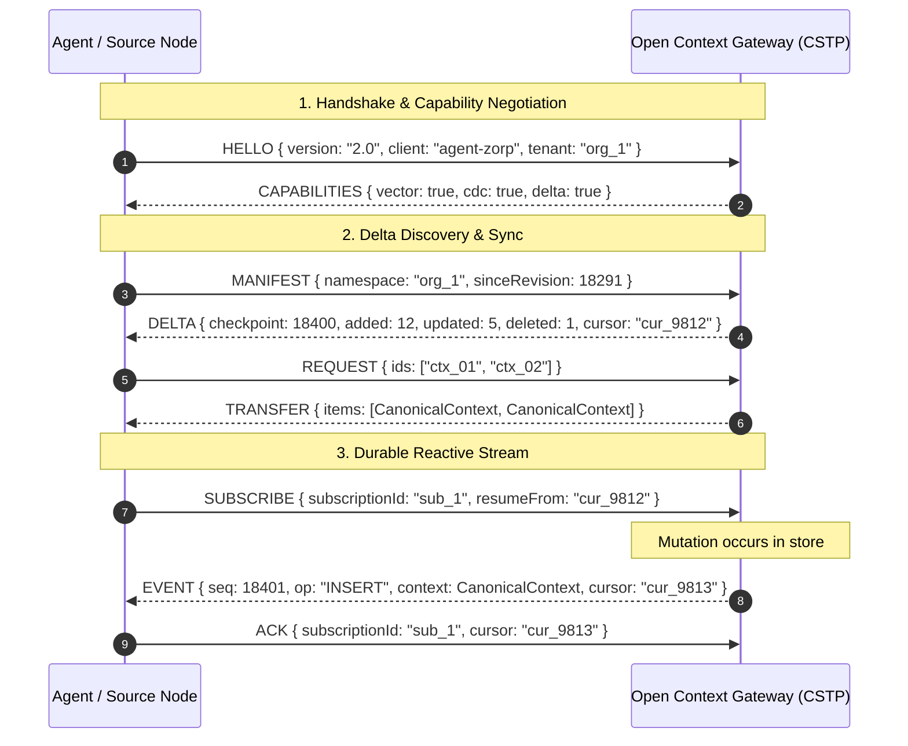

# Open Context 2.0 Specification
## The Open, Storage-Agnostic Context Data Plane for AI Agents

> **Document Version:** 2.0.0-PROPOSAL  
> **Status:** Approved Direction / Architectural Baseline  
> **Target Release:** Open Context 2.0  
> **Repository:** `aviskaar/open-context`  
> **Classification:** Core Technical Specification  

---

## Table of Contents

1. [Executive Summary & Core Positioning](#1-executive-summary--core-positioning)
2. [Guiding Tenets & Architectural Boundaries](#2-guiding-tenets--architectural-boundaries)
3. [System Topology & Product Hierarchy](#3-system-topology--product-hierarchy)
4. [Canonical Open Context Model (OCM 2.0)](#4-canonical-open-context-model-ocm-20)
5. [ContextStore Provider SPI (Storage Provider Interface)](#5-contextstore-provider-spi-storage-provider-interface)
6. [Provider SDK & Conformance Test Suite](#6-provider-sdk--conformance-test-suite)
7. [Context Portability & Migration Engine](#7-context-portability--migration-engine)
8. [Context Federation Engine](#8-context-federation-engine)
9. [Context State Transfer Protocol (CSTP)](#9-context-state-transfer-protocol-cstp)
10. [Delta Synchronization Engine](#10-delta-synchronization-engine)
11. [Reactive Context & Durable Event Engine](#11-reactive-context--durable-event-engine)
12. [Security, Governance & Provenance Model](#12-security-governance--provenance-model)
13. [Higher-Order Layer Separation (Context Compiler & Reasoner)](#13-higher-order-layer-separation-context-compiler--reasoner)
14. [Implementation Roadmap & Milestones](#14-implementation-roadmap--milestones)

---

## 1. Executive Summary & Core Positioning

### 1.1 The Problem
Today's AI agent ecosystem suffers from extreme fragmentation at the context layer:
- **Vendor Lock-in:** Agent memory and state are locked into specific proprietary databases, SaaS vector stores, or monolithic framework silos.
- **Dumb Storage vs. Monolithic Frameworks:** Storage adapters are reduced to lowest-common-denominator Key-Value/CRUD, stripping databases of their native capabilities (CDC, full-text, vector indices, graph traversal). Conversely, full agent frameworks intertwine state persistence with proprietary orchestration, reasoning heuristics, and LLM call-loops.
- **Static & Polling-Bound:** Agents repeatedly poll storage or downstream systems to observe state changes, wasting tokens, latency, and compute.
- **Incompatible State Representation:** Switching underlying storage engines (e.g., from local SQLite to cloud PostgreSQL or Redis) breaks context relationships, versions, provenance, and identifiers.

### 1.2 The North Star
Open Context is **not** an agent framework, **not** an orchestration layer, and **not** an opinionated memory app.

```
┌─────────────────────────────────────────────────────────────────────────────┐
│                                                                             │
│   "Open Context is the open, storage-agnostic context data layer            │
│                            for AI agents."                                  │
│                                                                             │
│     Bring your model. Bring your agent. Bring your database. Keep your      │
│                                  context.                                   │
│                                                                             │
└─────────────────────────────────────────────────────────────────────────────┘
```

Open Context operates as a **logical data plane** that owns the canonical context data model, lifecycle semantics, reactive event streaming, cross-store federation, and state synchronization protocol—while delegating physical bytes and indexing to underlying database providers.

---

## 2. Guiding Tenets & Architectural Boundaries

### 2.1 The Triad: Persistent, Portable, Reactive
1. **Persistent:** Context survives beyond conversations, ephemeral agent processes, models, and runtimes.
2. **Portable:** Context is structurally independent of the database vendor, agent framework, and LLM provider. Data moves losslessly between physical backends.
3. **Reactive:** Context changes trigger event streams. Agents subscribe to context mutations and wake up upon state transition rather than polling.

### 2.2 The Tripartite AI Architecture
To preserve strict separation of concerns across the modern AI stack, Open Context defines explicit boundaries with adjacent standards:

```
┌──────────────────────────────────────────────────────────────────────────┐
│                             THE AI STACK                                 │
├───────────────────┬──────────────────────────────────────────────────────┤
│ Protocol / Layer  │ Primary Role & Invariant                             │
├───────────────────┼──────────────────────────────────────────────────────┤
│ MCP               │ Moves Capabilities & Tools                           │
│ (Model Context)   │ "What tools, resources, and prompts can I access?"   │
├───────────────────┼──────────────────────────────────────────────────────┤
│ A2A               │ Moves Work & Delegation                              │
│ (Agent-to-Agent)  │ "Agent A assigns task X to Agent B."                 │
├───────────────────┼──────────────────────────────────────────────────────┤
│ Open Context /    │ Moves & Propagates Context State                     │
│ CSTP              │ "What context exists, where is it, how does it       │
│                   │  synchronize, and when has it changed?"              │
└───────────────────┴──────────────────────────────────────────────────────┘
```

- **Open Context does not replace MCP:** MCP tools connect agents to Open Context APIs.
- **Open Context does not replace A2A:** A2A orchestrates agent communication; Open Context tracks the immutable state and artifacts produced by agents, humans, CI/CD, webhooks, and sensors.
- **Open Context does not perform Semantic Reasoning in the Core:** The core protocol transfers and persists facts, decisions, and constraints deterministically with versions, timestamps, and provenance without performing LLM arbitration or deciding "which memory is universally true".

---

## 3. System Topology & Product Hierarchy

### 3.1 Architectural Diagram

```text
                      Agents / Applications / Runtimes
            Claude Code │ OpenAI Codex │ LangGraph │ AutoGen │ Custom
                                     │
                    MCP Server │ TypeScript/Python SDK │ REST/gRPC
                                     │
                                     ▼
     ┌───────────────────────────────────────────────────────────────┐
     │                      OPEN CONTEXT CORE                        │
     │                                                               │
     │  ┌───────────────────────┐         ┌───────────────────────┐  │
     │  │ Canonical Model (OCM) │         │ Query Routing Engine  │  │
     │  ├───────────────────────┤         ├───────────────────────┤  │
     │  │ Lifecycle & Version   │         │ Provenance & Security │  │
     │  └───────────────────────┘         └───────────────────────┘  │
     ├───────────────────────────────────────────────────────────────┤
     │                   OPEN CONTEXT DISTRIBUTED                    │
     │                                                               │
     │  ┌───────────────────────┐         ┌───────────────────────┐  │
     │  │ Context State Sync    │         │ Reactive Event Engine │  │
     │  │ (CSTP Engine / Delta) │         │ (Durable Subscriptions│  │
     │  ├───────────────────────┤         ├───────────────────────┤  │
     │  │ Federation Layer      │         │ Replication & Migrate │  │
     │  └───────────────────────┘         └───────────────────────┘  │
     └───────────────────────────────┬───────────────────────────────┘
                                     │
                       Storage Provider SPI (ContextStore)
                                     │
       ┌───────────┬───────────┬─────┴─────┬───────────┬───────────┐
       ▼           ▼           ▼           ▼           ▼           ▼
  PostgreSQL     Redis      MongoDB      SQLite    DynamoDB    SurrealDB
  (pgvector)   (Streams)   (Doc/Change) (Local)    (Serverless)(Graph/Multi)
```

### 3.2 Product Hierarchy
Open Context is structured in three explicit layers:

```text
1. OPEN CONTEXT CORE (L1 - Deterministic Foundation)
   ├── Canonical Open Context Model (OCM 2.0)
   ├── Storage Provider SPI (ContextStore)
   ├── Unified Query Engine & Predicate Language
   ├── Identity, Versioning & Vector Clocks
   ├── Provenance Tracking & Cryptographic Hashing
   └── In-flight Migrations & Transcoders

2. OPEN CONTEXT DISTRIBUTED (L2 - Network & Event Fabric)
   ├── Context State Transfer Protocol (CSTP)
   ├── Delta Synchronization & Checkpoints
   ├── Reactive CDC / Event Dispatcher
   ├── Durable Subscriptions, Cursors & Replay Engine
   └── Heterogeneous Multi-Store Federation

3. OPTIONAL HIGHER LAYERS (L3 - Intelligence & Framework Plugins)
   ├── Semantic Context Compiler (Token Budget Optimizer, Reranker)
   ├── LLM-Assisted Memory Extractor
   ├── Contradiction Detector & Heuristic Reconciler
   └── Framework Bridges (LangChain, LlamaIndex, MCP sidecars)
```

---

## 4. Canonical Open Context Model (OCM 2.0)

Context stored in Open Context is normalized into a unified, versioned, relational-graph entity regardless of the physical backend.

### 4.1 Canonical Data Entity Schema

```ts
export type ContextId = string; // ULID or URI-formatted deterministic ID
export type NamespaceId = string; // Organization or Multi-tenant partition
export type ScopeId = string; // e.g., "global", "workspace:aviskaar", "project:zorp", "session:sess_123"

export type ContextType =
  | 'message'        // Direct conversational utterance or prompt
  | 'fact'           // Atomic piece of verified knowledge
  | 'decision'       // Architecture/design decision made
  | 'constraint'     // Hard rule or operating boundary
  | 'preference'     // User, system, or project preference
  | 'artifact'       // Code snippet, document, diff, or file reference
  | 'observation'    // Environment state, run output, inspection result
  | 'tool_result'    // Execution result of an external tool or action
  | 'summary'        // Compressed abstraction of a larger context sequence
  | 'checkpoint'     // System snapshot or state marker
  | (string & {});   // Extensible custom domain types

export type LifecycleState =
  | 'active'         // Queryable, active in context window
  | 'archived'       // Retained for historical reference, excluded from default queries
  | 'deprecated'     // Superseded by newer context entry
  | 'soft_deleted'   // Marked for deletion, pending TTL garbage collection
  | 'pinned';        // Immune to automatic pruning or TTL expiration

export interface RelationshipEdge {
  targetId: ContextId;
  relation:
    | 'supersedes'     // Indicates this entry updates/invalidates targetId
    | 'derived_from'   // Indicates this entry is a summary/distillation of targetId
    | 'references'     // General semantic or structural link
    | 'child_of'       // Hierarchical parent-child relationship
    | 'caused_by'      // Causal event origin
    | string;
  metadata?: Record<string, unknown>;
}

export interface ContextProvenance {
  actor: 'user' | 'agent' | 'system' | 'integration';
  agentId?: string;
  model?: string;
  sourceUri?: string;
  signature?: string;          // Ed25519 signature of the payload
  contentHash: string;        // SHA-256 hash of normalized content payload
  derivationChain?: ContextId[];
}

export interface ContextTimestamps {
  createdAt: string;          // ISO-8601 UTC
  updatedAt: string;          // ISO-8601 UTC
  accessedAt?: string;        // ISO-8601 UTC
  expiresAt?: string;         // ISO-8601 UTC (TTL support)
}

export interface CanonicalContext {
  /** Global unique identifier (ULID recommended for monotonic indexing) */
  id: ContextId;

  /** Multi-tenant partition key */
  namespace: NamespaceId;

  /** Hierarchical or categorical scope partition */
  scope: ScopeId;

  /** Semantic type of the context item */
  type: ContextType;

  /** Unstructured or structured context payload */
  content: {
    text?: string;
    structured?: Record<string, unknown>;
    mediaType?: string;       // e.g., 'text/markdown', 'application/json'
    embedding?: number[];     // Optional pre-computed vector representation
  };

  /** Arbitrary domain-specific metadata */
  metadata: Record<string, unknown>;

  /** Traceability, origin, and cryptographic verification */
  provenance: ContextProvenance;

  /** Graph edges connecting this context item to other items */
  relationships: RelationshipEdge[];

  /** Timestamp auditing and lifecycle deadlines */
  timestamps: ContextTimestamps;

  /** Monotonic revision number and distributed vector clock */
  version: {
    revision: number;
    clock?: Record<string, number>; // Node ID -> logical counter
  };

  /** Current lifecycle status */
  lifecycle: LifecycleState;
}
```

### 4.2 Graph & Relationship Semantics
Context is naturally non-linear. The `relationships` array enables native graph traversals (e.g. `A supersedes B`, `B derived_from C`). When a provider supports native graph semantics (e.g., SurrealDB), queries compile directly into graph operators; on relational or document stores, Open Context compiles recursive CTEs or lookup pipelines.

---

## 5. ContextStore Provider SPI (Storage Provider Interface)

The Provider SPI defines the precise contract between the Open Context Core and physical database drivers.

### 5.1 Provider Capability Discovery

```ts
export interface ContextStoreCapabilities {
  /** Search and Retrieval */
  fullTextSearch: boolean;
  vectorSearch: boolean;
  graphTraversal: boolean;
  jsonPathQuerying: boolean;

  /** Transactions & Consistency */
  atomicTransactions: boolean;
  optimisticLocking: boolean;

  /** Lifecycle & Retention */
  nativeTtl: boolean;

  /** Reactive & Streaming */
  changeStreams: boolean;      // Real-time CDC
  durableCursors: boolean;     // Resumable stream offsets
  pubSub: boolean;

  /** Storage Scale */
  distributed: boolean;
  maxPayloadBytes: number;
}
```

### 5.2 The Unified `ContextStore` Interface

```ts
export interface ContextQuery {
  namespace: string;
  scope?: string | string[];
  types?: ContextType[];
  lifecycle?: LifecycleState[];
  filter?: Record<string, unknown>; // MongoDB-style or SQL-like AST predicate
  fullText?: string;
  vector?: {
    embedding: number[];
    topK: number;
    minSimilarity?: number;
  };
  relationships?: {
    relatedTo: ContextId;
    relation?: string;
    depth?: number;
  };
  pagination?: {
    limit: number;
    cursor?: string;
    order?: 'asc' | 'desc';
    orderBy?: 'createdAt' | 'updatedAt' | 'revision';
  };
}

export interface ContextBatchMutation {
  puts?: CanonicalContext[];
  updates?: Array<{ id: ContextId; expectedRevision: number; patch: Partial<CanonicalContext> }>;
  deletes?: ContextId[];
}

export interface ContextStoreSubscription {
  subscriptionId: string;
  namespace: string;
  filter?: {
    scopes?: string[];
    types?: ContextType[];
  };
  resumeFromCursor?: string;
}

export interface ContextChangeEvent {
  sequenceNumber: string;     // Monotonic or provider stream ID
  cursor: string;             // Opaque token to resume stream
  timestamp: string;
  operation: 'INSERT' | 'UPDATE' | 'DELETE' | 'LIFECYCLE_CHANGE';
  contextId: ContextId;
  previous?: CanonicalContext;
  current?: CanonicalContext;
}

export interface ContextStore {
  /** Unique provider name and target connection descriptor */
  readonly id: string;
  readonly capabilities: ContextStoreCapabilities;

  /** Connection Lifecycle */
  connect(): Promise<void>;
  disconnect(): Promise<void>;
  ping(): Promise<void>;

  /** CRUD Operations */
  put(context: CanonicalContext): Promise<CanonicalContext>;
  get(id: ContextId, namespace: string): Promise<CanonicalContext | undefined>;
  query(query: ContextQuery): Promise<{ items: CanonicalContext[]; nextCursor?: string; totalCount?: number }>;
  update(id: ContextId, namespace: string, expectedRevision: number, patch: Partial<CanonicalContext>): Promise<CanonicalContext>;
  delete(id: ContextId, namespace: string, hard?: boolean): Promise<boolean>;

  /** Atomic Transaction / Batch */
  batch(mutation: ContextBatchMutation): Promise<{ applied: boolean; committedRevision: number }>;

  /** Reactive Subscriptions */
  subscribe(sub: ContextStoreSubscription): AsyncIterable<ContextChangeEvent>;
  ack(subscriptionId: string, cursor: string): Promise<void>;
}
```

---

## 6. Provider SDK & Conformance Test Suite

To expand the ecosystem without bottlenecking core maintainers, Open Context exposes a formal Provider SDK and Conformance Harness.

### 6.1 Package Architecture
- `@opencontext/provider-sdk`: Core TypeScript interfaces, base abstract classes, serialization helpers, and query compiler utilities.
- `@opencontext/conformance-tests`: Automated black-box and white-box test suites verifying any provider against the contract.
- Individual Official Providers:
  - `@opencontext/provider-postgres` (PostgreSQL + pgvector + LISTEN/NOTIFY or logical decoding)
  - `@opencontext/provider-redis` (RedisJSON + RediSearch + Redis Streams)
  - `@opencontext/provider-mongodb` (MongoDB Atlas / Community + Change Streams)
  - `@opencontext/provider-sqlite` (SQLite3 / LibSQL + FTS5 + polling emulation)
  - `@opencontext/provider-dynamodb` (DynamoDB + DynamoDB Streams)
  - `@opencontext/provider-surrealdb` (SurrealDB Live Queries + Graph)
  - `@opencontext/provider-duckdb` (DuckDB embedded analytical store)

### 6.2 Conformance CLI Runner
Any third-party provider developer can run:

```bash
opencontext provider test --package ./my-custom-provider --dsn "custom://localhost:9000"
```

### 6.3 Conformance Certification Levels

```text
┌─────────────────────────────────────────────────────────────────────────────┐
│                   OPEN CONTEXT COMPATIBILITY MATRIX                         │
├───────┬──────────────────────┬──────────────────────────────────────────────┤
│ Level │ Tier Name            │ Required Capabilities Verified               │
├───────┼──────────────────────┼──────────────────────────────────────────────┤
│ Level 1 │ Core Persistence     │ CRUD, Canonical OCM normalization,           │
│       │                      │ namespace isolation, revision checks         │
├───────┼──────────────────────┼──────────────────────────────────────────────┤
│ Level 2 │ Advanced Query       │ Full-text search, pagination, relational     │
│       │                      │ traversal, complex predicate filtering       │
├───────┼──────────────────────┼──────────────────────────────────────────────┤
│ Level 3 │ Reactive & Streaming │ Change feeds (native or certified emulated), │
│       │                      │ durable subscriptions, cursor resume, acks   │
├───────┼──────────────────────┼──────────────────────────────────────────────┤
│ Level 4 │ Full Enterprise      │ L1-L3 + Vector similarity, ACID batches,     │
│       │                      │ native TTL expiry, graph relation queries    │
└───────┴──────────────────────┴──────────────────────────────────────────────┘
```

---

## 7. Context Portability & Migration Engine

Context must never become proprietary property of a database vendor.

### 7.1 Migration Pipeline
The Open Context Migration Engine allows live or offline streaming migrations between any two certified `ContextStore` endpoints:

```bash
# Migrate from local embedded SQLite to production PostgreSQL
opencontext migrate sqlite:///data/context.db postgres://user:pass@db:5432/context

# Transfer context partition between different clouds
opencontext transfer --source mongodb://cluster-a --target dynamodb://us-east-1 --scope "project:zorp"
```

### 7.2 Invariance Guarantees
During migration and transfer, the engine strictly guarantees invariance for:
- Deterministic IDs and UUID/ULID structures.
- Exact millisecond timestamps (`createdAt`, `updatedAt`).
- Complete provenance metadata, actor signatures, and content SHA-256 hashes.
- Version numbers and vector clock lineage.
- Graph edge topologies across entities.

---

## 8. Context Federation Engine

Modern agent systems execute in heterogeneous topologies: local edge agents (SQLite), hot operational working memory (Redis), and enterprise analytical context (PostgreSQL / DynamoDB).

### 8.1 Multi-Tiered Topology

```text
                             Logical Query
                 context.query({ scope: "workspace:aviskaar" })
                                   │
                                   ▼
                       Open Context Federation Layer
                                   │
         ┌─────────────────────────┼─────────────────────────┐
         ▼                         ▼                         ▼
   HOT / EPHEMERAL           WARM / DURABLE            COLD / ARCHIVAL
   Redis Provider         PostgreSQL Provider         DuckDB / S3
   - Active thread state  - Decisions & Constraints   - Long-term chat logs
   - TTL: 2 hours         - TTL: None                 - Analytical summaries
```

### 8.2 Federated Query Routing
The Federation Engine evaluates incoming `ContextQuery` descriptors against the capability and scope maps of configured stores:
1. **Scope Routing:** Routes `session:*` queries to the in-memory/Redis store; routes `org:*` or `project:*` queries to PostgreSQL.
2. **Scatter-Gather Execution:** For cross-scope queries, executes concurrent sub-queries across respective stores.
3. **Deduplication & Merge:** Combines result sets, resolves identical context entities via `version.revision` vector clock arbitration, and presents a single unified result.

---

## 9. Context State Transfer Protocol (CSTP)

### 9.1 Protocol Identity
To avoid collision with unrelated legacy standards, the protocol is formally designated:

> **CSTP: Context State Transfer Protocol**  
> *(Alternative Wire Identifier: `opencontext/2.0`)*

### 9.2 Frame Specification
CSTP is a framed, bidirectional protocol supporting WebSocket, gRPC, TCP, and Stdio transports. Framing uses standard JSON-RPC 2.0 or binary Protocol Buffers.

### 9.3 Core Protocol Primitives

```text
┌───────────────────────────────────────────────────────────────────────────┐
│                          CSTP PROTOCOL SUITE                              │
├─────────────────┬─────────────────────────────────────────────────────────┤
│ Primitive       │ Purpose                                                 │
├─────────────────┼─────────────────────────────────────────────────────────┤
│ HELLO           │ Initial protocol handshake, version negotiation         │
│ CAPABILITIES    │ Exchange supported features (FTS, Vector, CDC, etc.)    │
│ MANIFEST        │ Request index of context IDs, hashes & version vectors  │
│ REQUEST         │ Request specific context entities or missing ranges     │
│ TRANSFER        │ Stream payload data                                     │
│ SNAPSHOT        │ Bulk export of complete state for initial synchronization│
│ DELTA           │ Incremental change set (added, changed, deleted)        │
│ SUBSCRIBE       │ Register a persistent, filtered change stream           │
│ EVENT           │ Push notification of a context mutation                 │
│ ACK             │ Acknowledge receipt and commit subscriber cursor offset │
│ CHECKPOINT      │ Save sync state and freeze vector clock baseline        │
│ RESUME          │ Resume stream transmission from a specific cursor       │
│ UNSUBSCRIBE     │ Gracefully close active subscription                    │
└─────────────────┴─────────────────────────────────────────────────────────┘
```

### 9.4 Synchronization Flow



---

## 10. Delta Synchronization Engine

Rather than transferring massive multi-megabyte context dumps on every synchronization cycle, Open Context implements Git-like incremental delta synchronization.

### 10.1 Change Set Model

```ts
export interface ContextDeltaSet {
  namespace: string;
  fromRevision: number;
  toRevision: number;
  checkpointTimestamp: string;
  cursor: string;

  added: CanonicalContext[];
  updated: Array<{
    id: ContextId;
    revision: number;
    patch: Partial<CanonicalContext>;
  }>;
  deleted: ContextId[];
}
```

### 10.2 Monotonic Clock and State Reconciliation
Every mutation increments the local entity `version.revision` and appends an entry to the store's logical sequence log.
1. When nodes synchronize, the receiving node sends its highest acknowledged sequence/cursor.
2. The sending node queries its delta index: `SELECT * FROM mutations WHERE sequence > client_cursor`.
3. If the delta log is compacted or out of range, the protocol automatically falls back to generating a full `SNAPSHOT`.

---

## 11. Reactive Context & Durable Event Engine

### 11.1 The Reactive Paradigm
The traditional paradigm of agents polling for task status is eliminated:

```text
POLLING PARADIGM (Wasteful):
Agent A ──▶ "Is review complete?" ──▶ No (200 tokens)
Agent A ──▶ "Is review complete?" ──▶ No (200 tokens)
Agent A ──▶ "Is review complete?" ──▶ Yes (200 tokens)

REACTIVE PARADIGM (Open Context):
Agent A ──▶ context.subscribe({ scope: "review:pr_91", types: ["decision", "artifact"] })
Agent A ──▶ [Agent A suspends execution]
...
Agent B ──▶ context.put({ scope: "review:pr_91", type: "decision", content: "Approved" })
Open Context ──▶ [Pushes Delta Event] ──▶ Agent A Wakes Up & Resumes
```

### 11.2 Reactive DB Abstraction (Native vs. Emulated)
Open Context provides a unified `subscribe()` interface across all database engines:

```text
               context.subscribe(...)
                         │
                   Open Context
                         │
        ┌────────────────┼────────────────┐
        ▼                ▼                ▼
   PostgreSQL        MongoDB            SQLite
   Native CDC      Change Streams   Emulated Engine
  (WAL / LISTEN)    (Oplog feed)   (High-watermark poll)
```

- **Native Reactive Providers:** Postgres (logical replication/LISTEN), Mongo (Change Streams), Redis (Streams), DynamoDB (Streams), SurrealDB (Live Queries).
- **Emulated Reactive Providers:** SQLite, JSON, DuckDB utilize an internal high-watermark timestamp/sequence loop with zero external dependencies, guaranteeing the exact same event signature to application code.

### 11.3 Durable Cursors & Crash Recovery
Subscriptions are durable state machines. If an agent crashes or disconnects during network partitions:
1. Open Context buffers unacknowledged sequence frames per `subscriptionId`.
2. The agent reconnects and sends `RESUME { subscriptionId: "sub_sec", cursor: 18291 }`.
3. Open Context replays all missed events from offset `18292` through current sequence without data loss.

---

## 12. Security, Governance & Provenance Model

Context data is sensitive enterprise intellectual property and a primary target for prompt injection attacks.

### 12.1 Strict Separation: Context Data vs. Trusted Instructions

```
┌─────────────────────────────────────────────────────────────────────────────┐
│                       DATA PRIVILEGE BOUNDARY                               │
├─────────────────────────────────────────────────────────────────────────────┤
│  INCOMING DATA (CSTP / REST / MCP)                                          │
│  ├── Treated exclusively as passive data records.                           │
│  └── Never interpreted as executable system instructions or system prompts   │
│      without explicit client-side policy compiler validation.               │
└─────────────────────────────────────────────────────────────────────────────┘
```

### 12.2 Tamper-Evident Provenance
1. **Cryptographic Hashes:** Every context record computes `contentHash = SHA256(canonical_json(content))`.
2. **Actor Signatures:** External agents sign updates with Ed25519 private keys stored in `provenance.signature`.
3. **Audit Trail:** Derivations, summary transformations, and merges maintain parent IDs in `provenance.derivationChain`.

### 12.3 Namespace & Scope Access Control
- Multi-tenancy is enforced at the database level (`namespace`).
- Fine-grained Access Control (ABAC/RBAC) validates whether a requesting agent has `read`, `write`, or `subscribe` permissions for a given `scope` (e.g. `workspace:core-eng` vs `user:private`).

---

## 13. Higher-Order Layer Separation (Context Compiler & Reasoner)

To keep Open Context a clean, durable infrastructure layer, higher-order reasoning features are explicitly decoupled from the Core:

```text
┌─────────────────────────────────────────────────────────────────────────┐
│                      HIGHER-ORDER EXTENSIONS (L3)                       │
├──────────────────────────┬──────────────────────────────────────────────┤
│ Extension Module         │ Responsibility                               │
├──────────────────────────┼──────────────────────────────────────────────┤
│ @opencontext/compiler    │ Optimizes token budgets, applies semantic    │
│                          │ reranking, and packs context windows for LLMs│
├──────────────────────────┼──────────────────────────────────────────────┤
│ @opencontext/extractor   │ Prompts LLMs (Ollama/Claude/GPT) to ingest   │
│                          │ raw chat transcripts into canonical OCM items│
├──────────────────────────┼──────────────────────────────────────────────┤
│ @opencontext/reconciler  │ Detects contradictory facts across scopes    │
│                          │ and proposes human/agent resolution workflows│
└──────────────────────────┴──────────────────────────────────────────────┘
```

The Open Context Core remains 100% deterministic, high-throughput infrastructure.

---

## 14. Implementation Roadmap & Milestones

```text
┌───────────────────────────────────────────────────────────────────────────┐
│                   OPEN CONTEXT 2.0 ROADMAP PHASES                         │
├─────────┬────────────────────────────┬────────────────────────────────────┤
│ Phase   │ Name                       │ Key Deliverables                   │
├─────────┼────────────────────────────┼────────────────────────────────────┤
│ Phase 1 │ Canonical Model & SPI      │ • Formalize OCM 2.0 schemas        │
│         │ (v2.0-alpha)               │ • Implement ContextStore SPI       │
│         │                            │ • @opencontext/provider-sdk        │
│         │                            │ • Port Postgres/Redis/Mongo/SQLite │
├─────────┼────────────────────────────┼────────────────────────────────────┤
│ Phase 2 │ Reactive Subscriptions     │ • Native & Emulated CDC engine     │
│         │ (v2.0-beta)                │ • Durable cursor & replay manager  │
│         │                            │ • Conformance test CLI suite       │
├─────────┼────────────────────────────┼────────────────────────────────────┤
│ Phase 3 │ CSTP & Delta Engine        │ • Wire protocol implementation     │
│         │ (v2.0-rc)                  │ • Vector clock delta sync engine   │
│         │                            │ • Cross-DB live migration CLI      │
├─────────┼────────────────────────────┼────────────────────────────────────┤
│ Phase 4 │ Federation & Certification │ • Heterogeneous query router       │
│         │ (v2.0-GA)                  │ • "Open Context Compatible" cert   │
│         │                            │ • Production SDK & MCP 2.0 server  │
└─────────┴────────────────────────────┴────────────────────────────────────┘
```

---

*Open Context 2.0 Specification — aviskaar/open-context*
